# All the completed Hacking With Swift projects

## Challenges

___
### **_Challenge of projects 1-3 finished!_**

*The challenge was a to create an app that lists various flags in a table view, when selected slide in to view with the full flag.*

*As a bonus, was add the flag image beside the name of the country.*

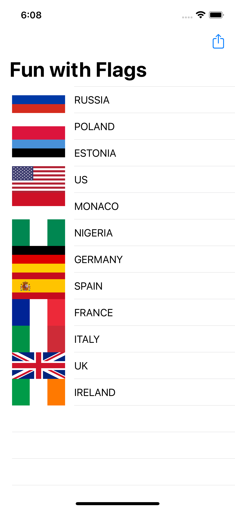___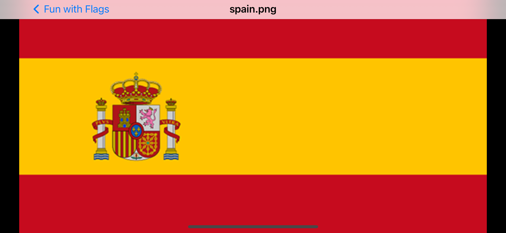
___		
### **_Challenge of projects 4-6 finished!_**

*This challenge was pretty simple, create an app that lets people create a shopping list by adding items to a table view.*

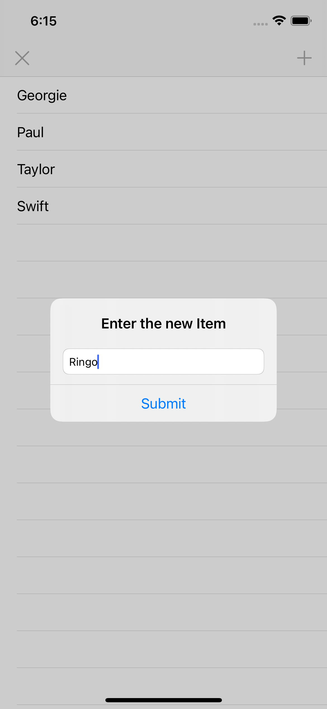

___	
		
### **_Challenge of projects 7-9 finished!_**

*The challenge was a to make a simple hangman game, but it's was also a bit tricky, and I also got a few ideas.*

*I was supposed to create the game in a table view, displaying the word with "?" and the player's score in the navigation bar, instead:*

* The labels, image view and the constraints were added programmatically
* Replace the "?" with "_" and used a label to display the word
* Created the images with MS Excel in 2min.
* Load all the words from a file
* Chars in swift is pretty tricky, need to think a lot of ways to make fully work.

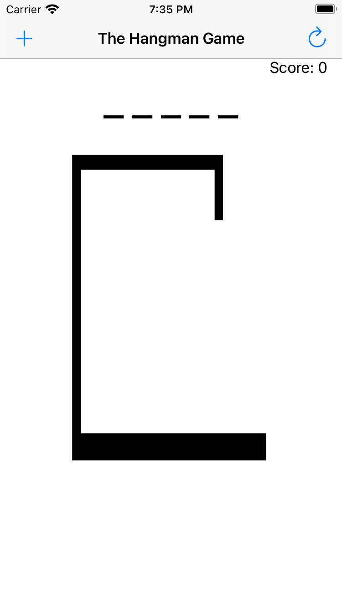___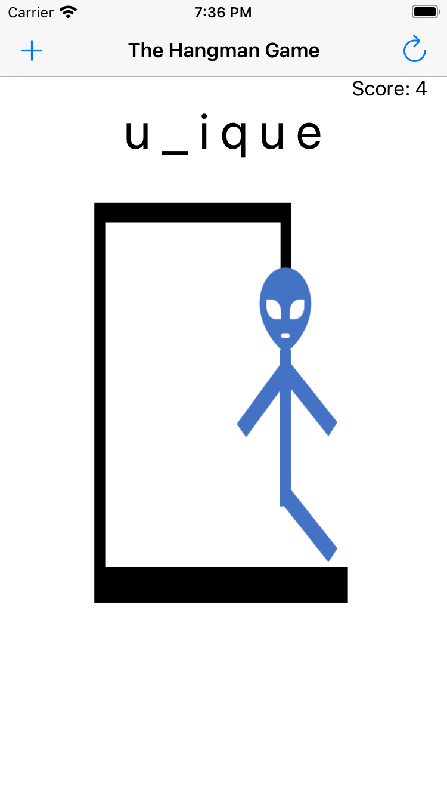
___
### **_Challenge of projects 10-12 finished!_**

*The challenge was to combine 2 previous projects, let users take photos with the camera or chose them from the photo library, add captions to it then display in a table view, with a second view showing the full image if selected*

* I tried to complete this challenge real quick, so didn't pay much attention to ui details.

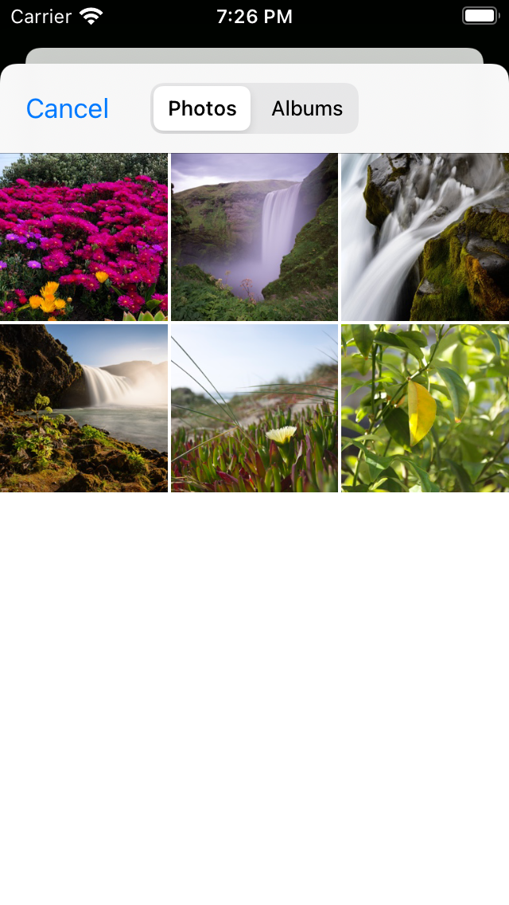___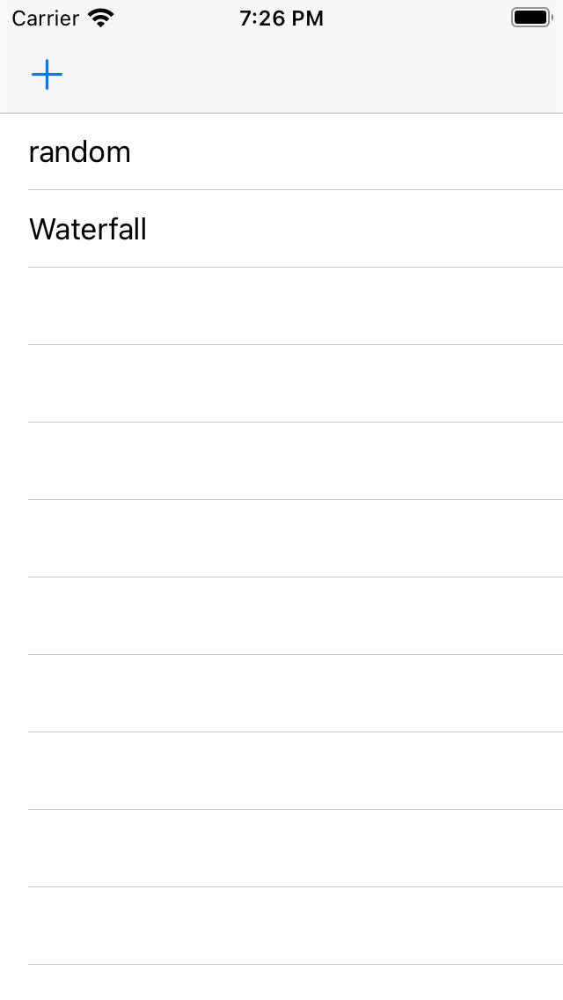___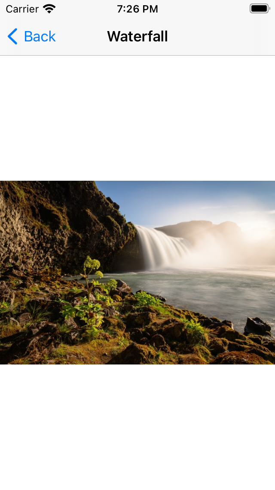
___
### **_Challenge of projects 13-15 finished!_**

*The challenge was to create a app with a table view that displayed a small list of countries and a second view with some details of the selected country.*
*I got a little bit excited and went a bit further:*

* Got the data from a API (https://restcountries.eu),
* Created a webView to display the flag (because the format is .svg), and adjusted the CSS to make the image full,
* Created a filter to make it easy to find a specific country.

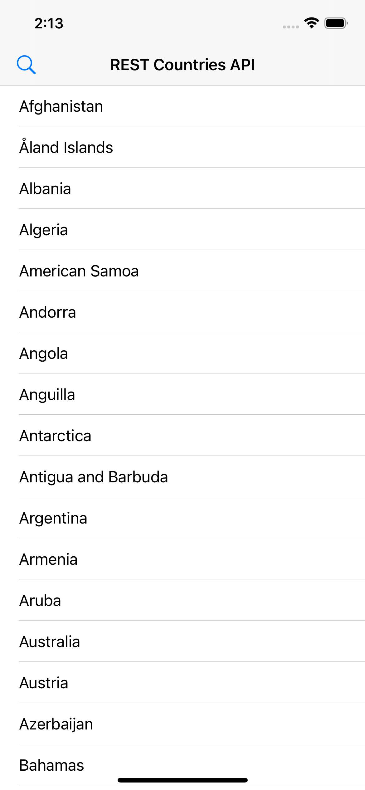___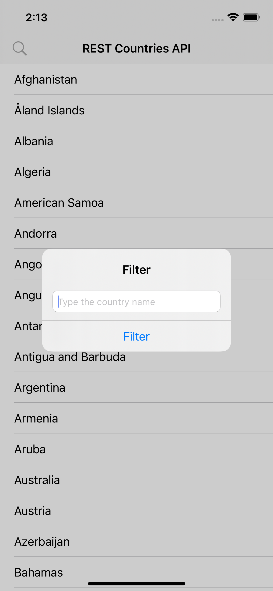___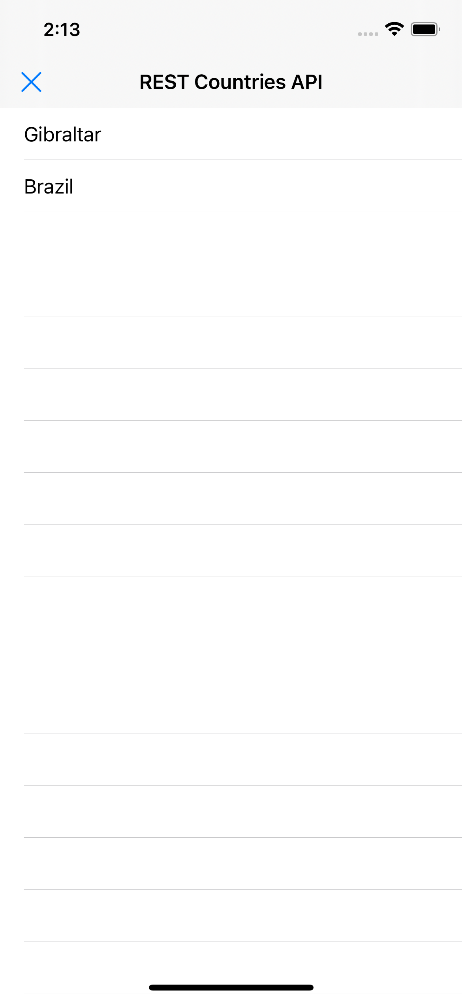___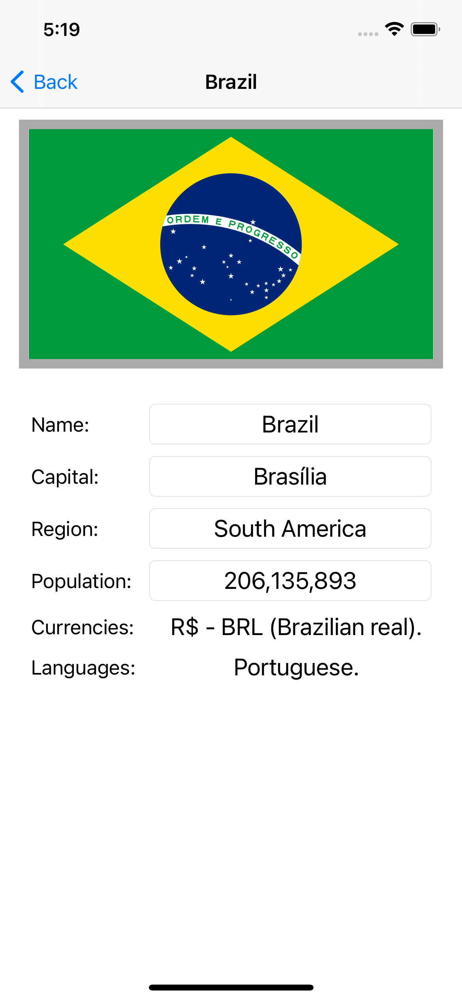
___
### **_Challenge of projects 19-21 finished!_**

*The challenge was to create a notes app, with a navigation controller, a table view controller and a detail view controller with a full-screen text view*

* A table view that lists the notes titles
* A detail view controller that contains a full-screen text view
* The notes were saved with UserDefaults
* Add tool bar itens (compose and delete)
* Add the option to share the text with UIActivityViewController
* Fixed the keyboard displaying over the text view with NotificationCenter

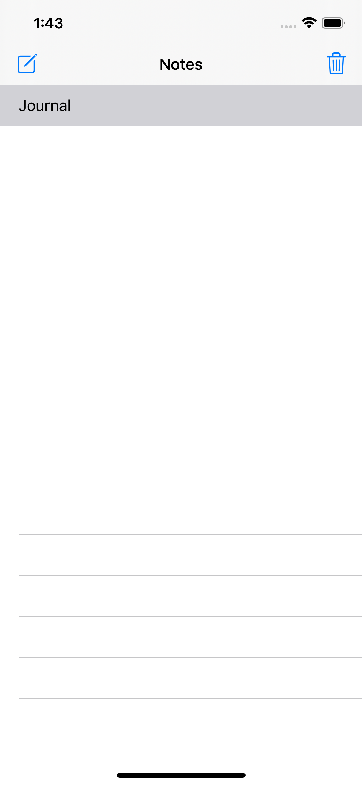___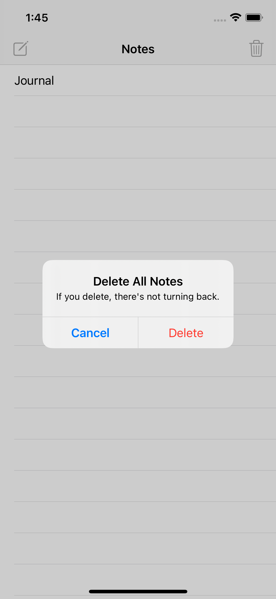______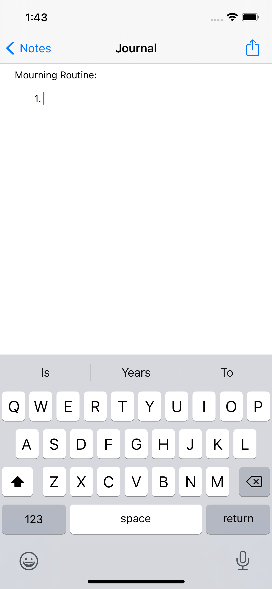
___
### **_Challenge of projects 22-24 finished!_**

*The challenge was to create some extensions for:*

* UIView - *Animation to scale its size down to 0.0001*
* Int - *A method that runs a closure as many times as the parameter*
* Array - *A mutating method, that removes the first instance of the repeated item*
___
## Projects

#### **_Finish project 1 - StormViewer_**

*Simple app that let users scroll through a list of images, then select one to view*
*Topics covered:*

* _Table views, image views, app bundles, FileManager, typecasting, view controllers, storyboards, outlets, Auto Layout, UIImage._
___
#### **_Finish project 2 - Guess the Flag_**

*Simple game that display 3 images and asks them to choose which one belongs to the country named in the title*

*Topics covered:*

* _@2x and @3x images, asset catalog, UIButton, CALayer, UIColor, random numbers, actions, UIAlertController._
___
#### **_Finish project 3 - Social Media_**

*This project was to modify project 1, to make users able to share the images they selected*

*Topics covered:*

* _UIBarButtonItem and UIActivityViewController._
___
#### **_Finish project 4 - Easy Browser_**

*The project was to create a simple browser app with users been able to choose a website only from a list*

*Topics covered:*

* _loadView(), WKWebView, delegation, URL, URLRequest, UIToolbar, UIProgressView, KVO._
___
#### **_Finish project 5 - Word Scramble_**

*The project was to create a word game that deals with anagrams.*

*Topics covered:*

* _UITableView - how to reload data and insert rows_
* _UIAlertController - how to add text fields_
* _Swift Strings_
* _Closures_
* _NSRange_
___
#### **_Finish project 6 - Auto Layout_**

*Learn about auto layout advance techniques and how to do it programmatically.*
___
#### **_Finish project 7 - Whitehouse Petitions_**

*The project take the data feed from a website and parse it into useful information for users (decoding json).*

*Topics covered:*

* _JSON_
* _Codable protocol_
* _UITabBarController_
* _UIStoryboard_
___
#### **_Finish project 8 - 7 Swifty Words_**

*The project was to create a word game, giving the users a list of hints and an array of buttons with different letters on.*

*Topics covered:*

* _addTarget()_
* _enumerated()_
* _joined()_
* _replacingOccurrences()_
___
#### **_Finish project 9 - Grand Central Dispatch_**

*The project was to solve one problem with the project 7, since it takes data from the web, the app will be frozen until the data has been transferred.*

*Topics covered:*

* _GCD - Do things in the background_
___
#### **_Finish project 10 - Names to Faces_**

*The project was to create a collection view with images and names choosen by the user*

*Topics covered:*

* _UIImagePickerController_
* _UUID_
* _NSObject subclasses_
* _fatalError()_
___
#### **_Finish project 11 - Pachinko_**

*The project was to create a game using SpriteKit, very similar to peggle*

*Topics covered:*

* _SpriteKit_
* _Physics_
* _Blend modes_
* _Radians_
* _CGFloat_
___
#### **_Finish project 12 - UserDefaults_**

*This technique project was to solve the problem of project 10, when the names and images didn't get saved*

*Topics covered:*

* _UserDefaults_
* _Codable_
* _NSCoding_
___
#### **_Finish project 13 - Instafilter_**

*This project let users to choose a picture from their photos, then manipulate it with a series of Core Images filters, then they can save the processed image back to their photo library*

*Topics covered:*

* _UISlider_
* _Core Image_
* _Save images to library_
___
#### **_Finish project 14 - Whack-a-Penguin_**

*This project was to create a game with SpriteKit for ipads similar to whack-a-mole game*

*Topics covered:*

* _SKCropNode_
* _SKTexture_
* _asyncAfter()_
* _SKAction_
___
#### **_Finish project 15 - Animation_**

*This project was to intruduce to animation, making things move, scale, rotate, etc.*

*Topics covered:*

* _animate(withDuration:)_
* _Spring animations_
* _Alpha Values_
* _CGAffineTransform_
___
#### **_Finish project 16 - Capital Cities_**

*Created a map app with some capitals locations using:*

* _MKMapView_
* _MKAnnotation_
* _MKPinAnnotationView_
* _CLLocationCoordinate2D_
___
#### **_Finish project 17 - Space Race_**

*Created a game really fast and really cool, a survive game where a space pilot needs to survive a field of space junk*

*Topics covered:*

* _Per-pixel collision detection_
* _Advancing particle systems_
* _Timer_
* _Linear and angular damping_
___
#### **_Finish project 18 - Debugging_**

*This topic was to introduce to a few debuggin techniques*

*Topics covered:*

* _print()_
* _assert()_
* _Breakpoints_
* _View debugging_
___
#### **_Finish project 19 - JavaScript Injection_**

*This project teach how to build a bridge between JavaScript and Swift*

*Some Topics covered:*

* _NotificationCenter_
* _UITextView_
* _NSExtensionItem_
___
#### **_Finish project 20 - Fireworks Night_**

*This project we created a basic space game, but still pretty fun*

*Some Topics covered:*

* _follow()_
* _UIBezierPath_
* _for case let_
___
#### **_Finish project 21 - Local Notifications_**

*Simple project to show how to scheduled a local alert to be shown at a specific day and time*

*Some Topics covered:*

* _UNUserNotificationCenter_
* _UNNotificationRequest_
___
#### **_Finish project 22 - Detect-a-Beacon_**

*Simple project detect and range beacons*

*Some Topics covered:*

* _Core Location_
* _CLBeaconRegion_
___
#### **_Finish project 23 - Swifty Ninja_**

*Pretty fun game, similiar to the ninja fruit game, only with penguins*

*Some Topics covered:*

* _SKShapeNode_
* _AVAudioPlayer_
* _CaseIterable_
* _removeFirst_
___
#### **_Finish project 24 - Swift String_**

*Explanation of how strings are different from arrays, how to write extensions and how NSAttributedString lets us add formatting to strings*

*Topics covered:*

* _NSAttributedString_
* _Extenstions_
___
#### **_Finish project 25 - Selfie Share_**

*This project was to create a simple peer to peer internet connection*

*Topics covered:*

* _Peer to peer networking_
* _Collection views_
* _GCD_
___
